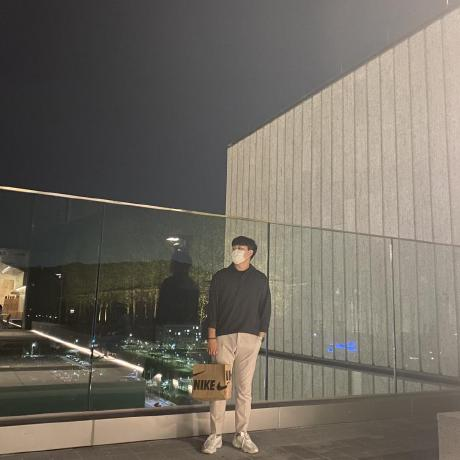

 

# 새로운 것을 만드는 것을 좋아하는 개발자, 오태훈 입니다.
> 내가 아는 것을 활용하여 새로운 가치를 창출하는 것, 그것을 즐길 줄 아는 개발자 입니다.

## Introduce!

---
- 이름 : 오태훈(Taehun Oh)
- 나이 : 1998년 생 (만 23세)
- 취미 : 공공데이터분석, 드라이브
- 블로그()
- Github [RosieOh - overview](https://github.com/RosieOh)

---

## 🏆경력
- 주)에코바이오의학협회 전산팀 프론트엔드
- 주)다른코리아 개발팀 프론트엔드, 백엔드 인턴
- 주)에코바이오의학협회 취업연계국가근로 프론트엔드 개발
- 주)디엘아이티 전산, 사무업무
- 공군 제 18전투비행단 예비역 병장(2018.8 ~ 2020.5)
- 한남대학교 린튼글로벌스쿨 글로벌비즈니스전공 / 융합학부 빅데이터전공

---

## 활동
- 한남대학교 창업지원단 주관 창업진흥원 연계 초기창업패키지 '팀림크드' 대표 및 풀스택 개발자(2022.03 ~ 현재)
- BDAA(Big Data Analytics Association)2기 운영
- 2022 대전청년네트워크 환경분과 환경데이터분석 총괄
- 2021 대덕구 청년네트워크 2기 일자리분과 데이터분석 총괄(2021.05 ~ 2021.12) 
- 한남대학교 창업지원단 주관 초기창업패키지 '청춘의 한 장' 전략기획 실무(2021.02 ~ 2021.12)

## Contact
📱 카카오톡 ID : sirious920

📱 Email : dhxogns920@naver.com

---

## 💻 Stacks
### DataScience
- `Python`
- `Pandas`, `NumPy`, `Matplotlib`, `Seaborn`, `Bokeh`
- `Scikit-learn`, `Tensorflow`, `Keras`, `PyTorch`, `Pydicom`
- `R`
- `SQL`
- `Hadoop`

### Front_end

- `HTML5`, `CSS3`, `JavaScript ES6++`
- `React`

### Back_end

- `Django`
- `Flask`
- `JSP`

### Process

- 모니터링 - `Google Analytics`
- 커뮤니티 - `Slack`
- 이슈관리 - `Github`
- 버전관리 - `Git` 

---

## Project

### [응급의료 병상 부족 문제 해결방안 연구]
- 기간 : 2021.10 ~ 2021.12
- 소개 : COVID-19 상황으로 인한 응급실 병상 부족 문제 해결 방안 제시
- 역할 : 데이터정제, 클렌징, 시각화, 정책 제안
- 사용한 Skill, 지식 : R, Python, Numpy, Pandas, Bokeh

### [MediRing]
- 기간 : 2022.03 ~ 현재
- 소개 : 빅데이터 분석 기반 영양제 추천 시스템 플랫폼
- 역할 : 팀 내 총괄, 풀스택 개발자
- 사용한 Skill. 지식 : Python, Slack, HTML5+CSS3, Django, React

### [멘도롱대학]
- 기간 : 2021.02 ~ 현재
- 소개 : 전국 대학교 대상 대학생 멘토링 매칭 플랫폼
- 역할 : 전략기획 실무
- 프로토 타입 : http://mendorong-university.com/

### [반려동물 행동 패턴 분석 식단 추천 어플]
- 기간 : 2022.07 ~ 현재
- 소개 : 딥러닝 방식 반려동물 행동 패턴 분석 식단 추천 어플리케이션
- 역할 : 1인 기획 및 개발
- 사용한 Skill. 지식 : Python, Slack, HTML5+CSS3, Django, React

---

- 👋 Hi, I’m @RosieOh
- 👀 I’m interested in ...
- 🌱 I’m currently learning ...
- 💞️ I’m looking to collaborate on ...
- 📫 How to reach me ...
